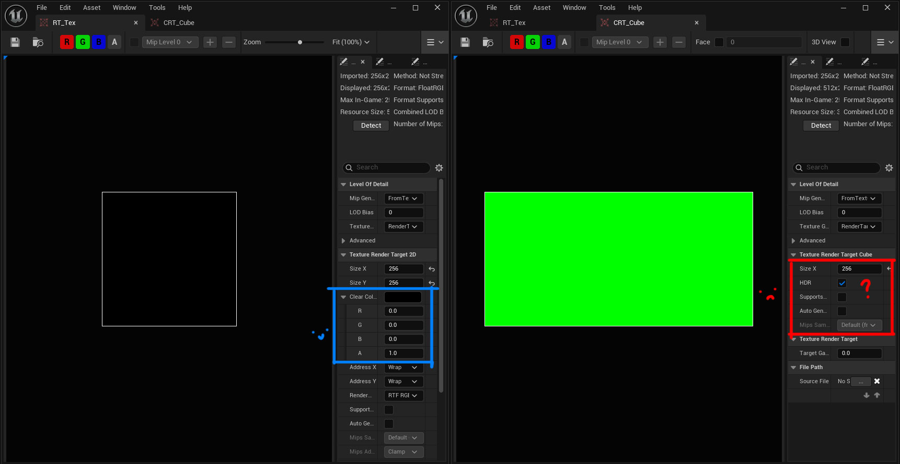
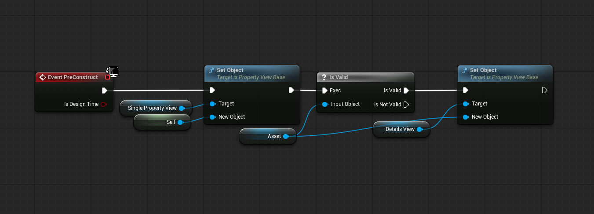
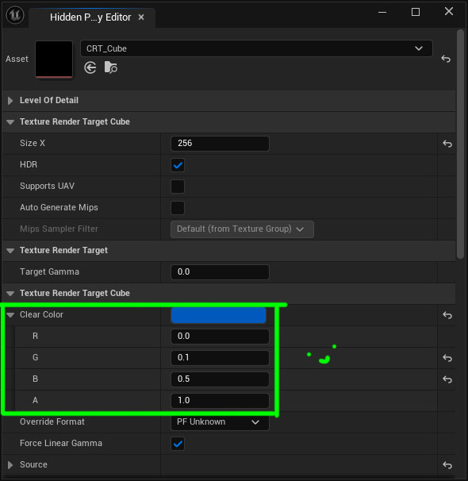

Sometimes when editing assets in UE5 some needed properties are not exposed. A glaring example is how the **Clear Color** property is exposed for _RenderTarget2D_ but not for _RenderTargetCube_ or _RenderTargetVolume_, defaulting to that very well known bright green that might show up when you least expect it.

Some time ago I found an obscure option on the **Details View** Widget called **'Force Hidden Property Visibility'** which as per its tooltip:
> If true, all properties will be visible, not just those with CPF_Edit

So we'll need to build a small tool around it.

## How to build it

Here's how I built a very simple **Hidden Property Editor** tool:

1. Create an Editor Utility Widget
2. In the Widget Blueprint's Designer View add a **Single Property View** and a **Details View** and for both of them enable _'Is Variable'_
3. For the Details View enable _'Force Hidden Property Visibility'_
4. In the Widget Blueprint's Graph View create a variable of type **Object > Object Reference** and name it "Asset"
5. In the graph's PreConstruct Event add some more nodes as follows:

6. Now run the Widget and select the asset

Now you can edit everything you ever need :)

## Or if you're not too inclined...

Building this Blueprint is dead simple but maybe you can't be bothered. Sure, I get it.

Here's the [UAsset file](../posts/EUW_HiddenPropertyEditor.uasset) for UE 5.8. It's self-contained so just drop it anywhere and run it. That's it.

## Comments?
If you have any comments or questions feel free to reply to the relevant [Twitter post](https://x.com/ChoskerSanz/status/2073863088999125048), [Bluesky post](https://bsky.app/profile/chosker.bsky.social/post/3mpwfbb32wk2s) or [LinkedIn post](https://www.linkedin.com/posts/oscarsanz_techart-ue5-share-7479628809164488704-bghu/).