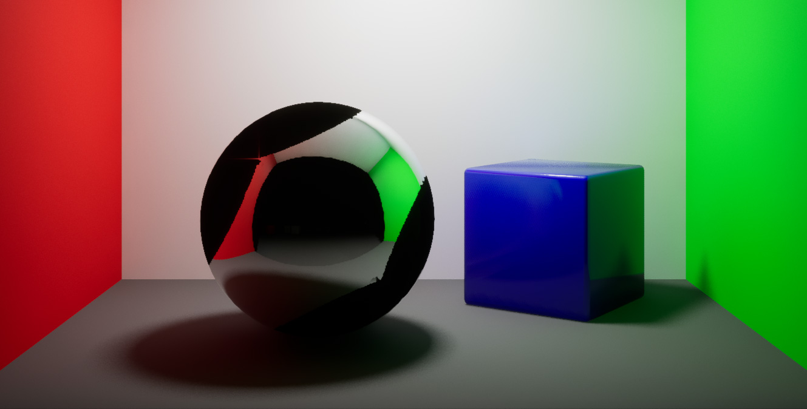
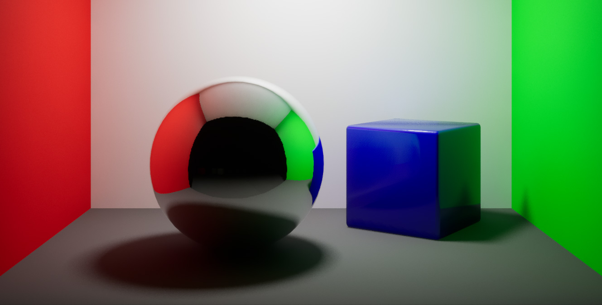
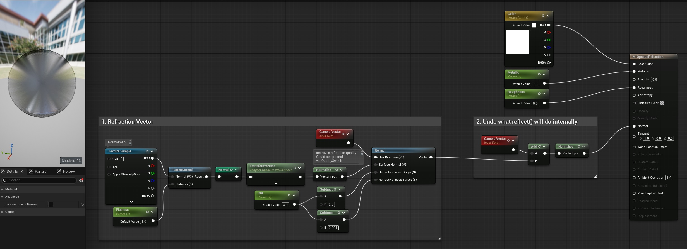
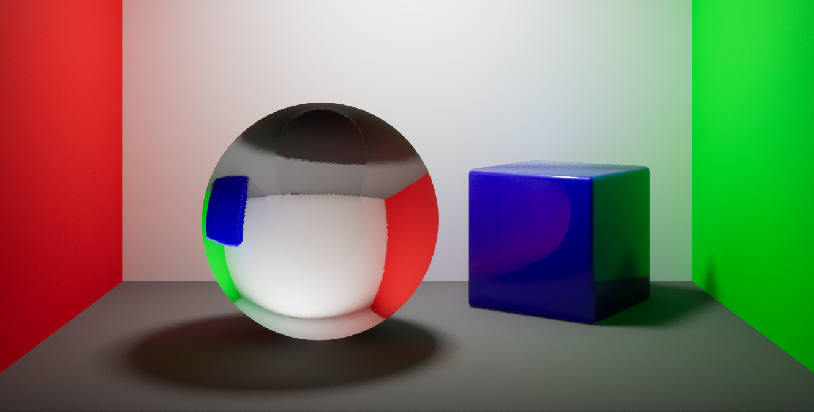
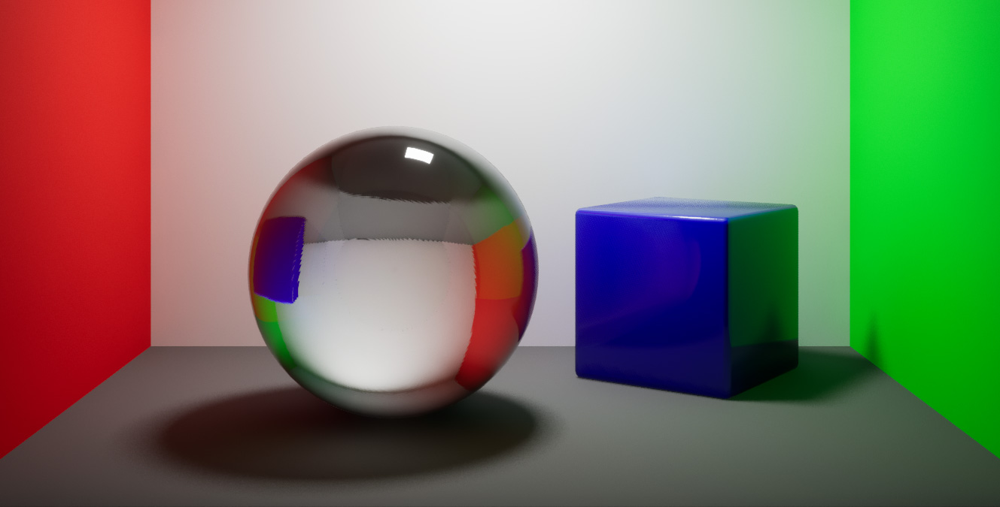
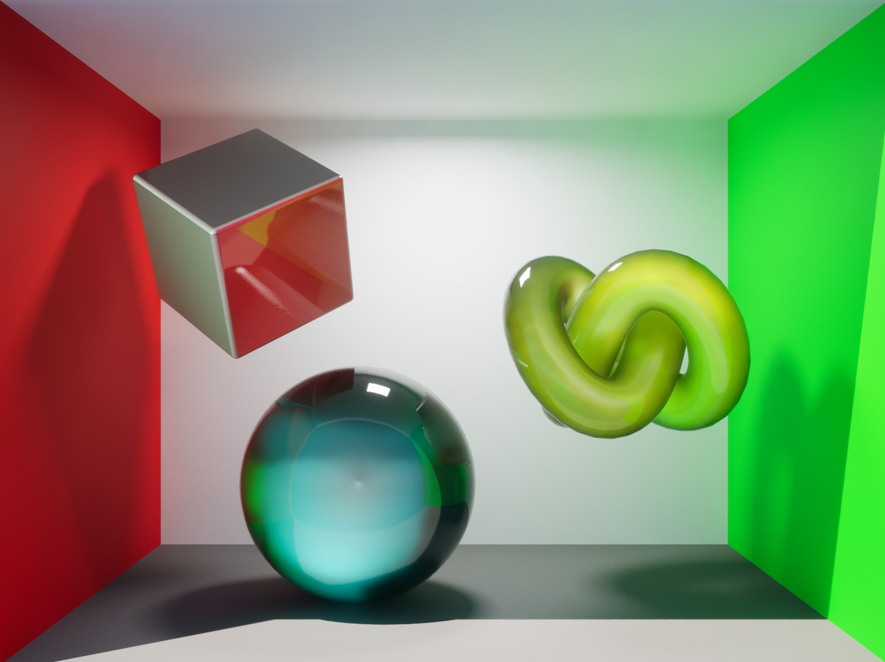

Many years ago I came across this UE4 [forum post](https://forums.unrealengine.com/t/abusing-ue4s-reflection-system-for-cheap-translucency/215871) by ThomasKole where he'd alter the Normal in the material to point inwards, turning reflections inside out effectively making them act somewhat as a refraction.

The idea seemed great as it allowed rendering **opaque objects as see-through** and potentially refractive, without the typical issues that come with a Translucent shader: overdraw cost, poor lighting and shadowing, sorting issues, etc.
I tried it back then but the results didn't seem convincing. The provided method was limited to a see-through effect as opposed to a distorted refraction and it had artifacts with SSR. The idea stayed in the back of my mind though.

Recently I saw artstation post from [Vishal Ranga](https://www.artstation.com/artwork/WXyxgJ) that sparked my interest in this technique again. It was great to see it in UE5 using Lumen but it had some of the same limitations as the original post. So I started my little journey.

## The minimal starting point

First we need a StaticMeshActor with **'Affect Distance Field Lighting' disabled**, otherwise Lumen's SWRT will trace through the mesh and will show the mesh's own distance field representation inside it. Unfortunately this means for Lumen SWRT this object will not be visible in reflections or bounce GI or AI.

I've made a few attempts to work around this limitation but I've had no luck so far so I figured it's a challenge for another day.
Fortunately with Lumen HWRT this limitation does not apply.

Then we need an Opaque Material with **'Tangent Space Normal' disabled**.

## Fixing SSR for Refraction-like Reflections

The first limitation in the attempts I'd seen was SSR's artifacts. SSR is designed for reflections and it bugs out when the reflection vector points inwards instead of outwards from the surface.

By now you'll have noticed I'm targeting Lumen here. I'm pretty sure this could be applied to non-Lumen SSR coupled with Reflection Captures but that's beyond the scope of this post :)

If we try anything interesting with the Normals the SSR bugs out. For example here's what happens if I multiply the VertexNormal with -1 to invert the value:


Disabling Lumen's Reflections Screen Traces _would_ fix it, but that would be an unacceptable compromise.
So we need to alter Lumen's SSR behavior, and there's 2 ways to do it:

<br>

#### Option 1: HistoryDepthTestRelativeThickness cvar
Lumen has this `r.Lumen.Reflections.HierarchicalScreenTraces.HistoryDepthTestRelativeThickness` cvar which defaults to `0.005` that helps sampling depth for Lumen's SSR more accurately. Setting it to `0.0` changes its behavior in a way that gives us what we need: SSR hits that go inwards will now be skipped.

Doing this however degrades the quality of Lumen's SSR, so this should be a deliberate decision.
Here's the default behavior vs the edited cvar:

../posts/2026-09-26-02-cvardefault.jpg
../posts/2026-09-26-03-cvar0.jpg

comparison_1


<br>

#### Option 2: Engine Shader Edit

With a quick edit to the Engine Shaders we can get the behavior we need without degrading the reflections. As we're only editing the engine Shaders (but not the code) we only need to edit a text file on the Launcher version of Unreal as I've shown before in my post about [Editing the Engine Shaders](https://chosker.github.io/blog/editing-engine-shaders).

We need to edit the `Engine\Shaders\Private\Lumen\LumenReflectionTracing.usf` file. As of UE 5.8 in line 191 you'll find the following code:
```hlsl
bHit = abs(HistoryDeviceZ - PrevDeviceZ) < HistoryDepthTestRelativeThickness * lerp(.5f, 2.0f, Noise);
```
and right after that add the following:
```hlsl
// Skip inwards SS Reflection hits to allow cheap Refraction - Start
float2 PixelSize = View.BufferSizeAndInvSize.zw;
float2 UVLf = ScreenUV - float2(PixelSize.x, 0.0);
float2 UVRt = ScreenUV + float2(PixelSize.x, 0.0);
float2 UVUp = ScreenUV - float2(0.0, PixelSize.y);
float2 UVDn = ScreenUV + float2(0.0, PixelSize.y);
float ZLf = Texture2DSampleLevel(SceneDepthTexture, GlobalPointClampedSampler, UVLf, 0).x;
float ZRt = Texture2DSampleLevel(SceneDepthTexture, GlobalPointClampedSampler, UVRt, 0).x;
float ZUp = Texture2DSampleLevel(SceneDepthTexture, GlobalPointClampedSampler, UVUp, 0).x;
float ZDn = Texture2DSampleLevel(SceneDepthTexture, GlobalPointClampedSampler, UVDn, 0).x;
float3 PLf = GetTranslatedWorldPositionFromScreenUV(UVLf, ZLf);
float3 PRt = GetTranslatedWorldPositionFromScreenUV(UVRt, ZRt);
float3 PUp = GetTranslatedWorldPositionFromScreenUV(UVUp, ZUp);
float3 PDn = GetTranslatedWorldPositionFromScreenUV(UVDn, ZDn);
float3 GeometryWorldNormal = normalize(cross(PRt - PLf, PDn - PUp));
float3 RayDir = normalize(TranslatedWorldPosition - View.TranslatedWorldCameraOrigin);
if (bHit && dot(WorldNormal, GeometryWorldNormal) > -0.75)
{
	bHit = false;
}
// Skip inwards SS Reflection hits to allow cheap Refraction - End
```
The code reconstructs the World Normal so it can compare it against the edited Normal to determine if it's inside out to skip SSR on that pixel.

As you can see the code is sampling the Scene Depth Texture 4 times which on paper should add some cost. In practice I did not notice the slightest performance hit but depending on your target spec your mileage may vary.

And with that we've fixed SSR's behavior:


## Refracting the Normals

With the SSR artifacts out of the way it's time to build the material. There's different ways to go at it and here's mine:

Section 1 is the Refraction Vector. Simple and cheap, and it very closely matches the behavior of Ray Tracing Refraction.

Section 2 is **the little trick that makes it all work**: it counters what the shader will internally do to the Normal vector (to convert it to a Reflection Vector before using it on reflections), making our refraction vector actually used as we need it.

And with that we have working refractions with an IOR parameter (set to 2.5 in this case):


## Finishing up

The refraction works but it looks rather flat. In this case we've clearly made something that looks like solid glass but it's missing the reflections.
I played around with the Clear Coat shading model but even with 'Clear Coat Enable Second Normal' activated in the Project Settings and making a specific Second Normal in the material I couldn't quite get it to work. Another challenge for another day.

For now I've added a Translucent Overlay Material to get additional reflections on top. It incurs on some overdraw but at least it's guaranteed the solid version will always be behind it so overdraw will not stack up. And we can use the 'Overlay Material Max Draw Distance' value to cull it.

I've also added a dark Fresnel to the material to match real life refraction behavior a bit better.


Since we're using the actual geometry normals (and supporting the use of a Normalmap) the refraction will look correct regardless of the mesh. However the effect is somewhat inaccurate on flat geometry so it's not fit to represent a clean glass pane or to replace the use of Translucency for things like particles.

Here's a final test with a couple other shapes and colors, and even increasing the Roughness on the sphere to have blurry refractions (which shows a pinch at the center, and is limited to 0.3 before it starts to degrade).


## What about performance?

We're still using Lumen Reflections here so the cost of the basic refraction part is the same, plus the marginal cost of the normals manipulation in the Material and the 4x neighbor Depth buffer sample in the engine edit. All of this is minimal and very much worth it if you want this kind of effect, but as usual you should profile on your specific target hardware.

Anything on top (such as an Overlay Material) is really up to you to manage the cost.

## Comments?
If you have any comments or questions feel free to reply to the relevant [Twitter post](#), [Bluesky post](#), [ArtStation post](#), [LinkedIn post](#) or [Reddit post](#).